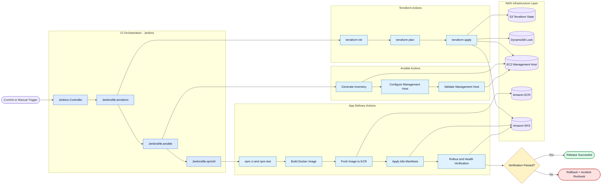
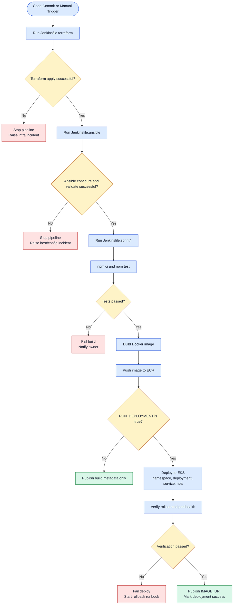
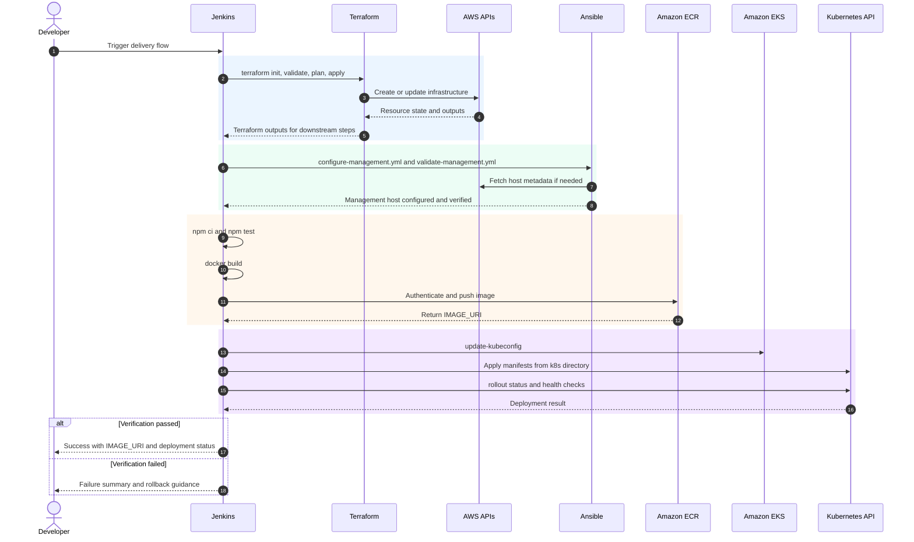
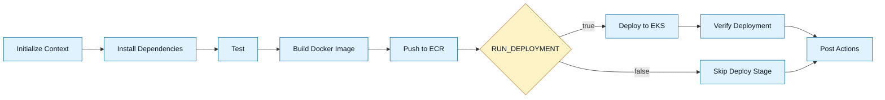

# Execution Flow Diagrams

This document provides visual execution flow and sequence diagrams for Sprint 4 operations.

## 0. Primary Visual Execution Map

## 1. End-to-End Execution Flow

## 2. Execution Sequence (Cross-System)

## 3. Sprint 4 Pipeline Stage Map

## 4. Recommended Execution Sequence

1. Run Jenkinsfile.terraform
2. Run Jenkinsfile.ansible
3. Run Jenkinsfile.sprint4

If rollout verification fails, follow the rollback and incident flow in the support runbook.
